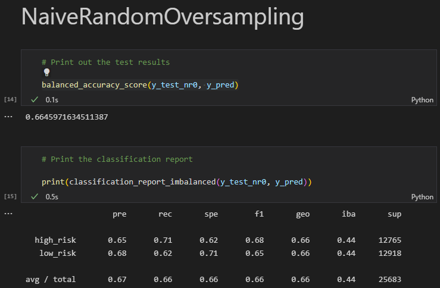
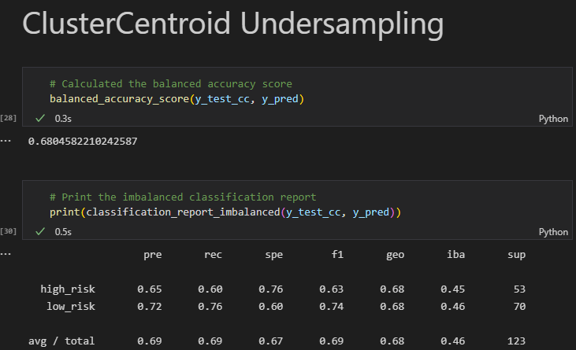
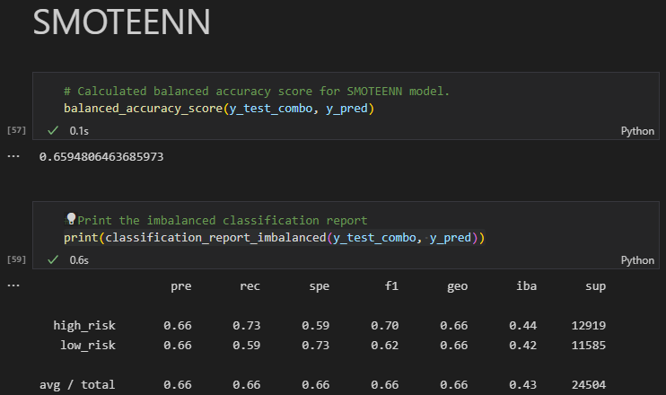

# Challenge 17, Deliverable 4
## Overview of the analysis
The purpose of this analysis is to measure the success of each model (which is measured by a number of metrics like accuracy, precision, recall, and ordering the importance of the features measured) against loan data. From the given data, we want our models to be able to predict if someone applying for a loan will be a high or low risk loan recipient. We compare the different models' success rates against each other to determine which is the best for this use case.

## Results
Naive Random Oversampling 
- accuracy: 0.6645971634511387
- precision: 0.65
- recall (sensitivity): 0.71
- f1: 0.68

SMOTE Oversampling
- accuracy: 0.6867426353229782
- precision: 0.66
- recall (sensitivity): 0.76
- f1: 0.68

ClusterCentroid Undersampling
- accuracy: 0.6804582210242587
- precision: 0.65
- recall (sensitivity): 0.60
- f1: 0.63

SMOTEENN Combination
- accuracy: 0.6594806463685973
- precision: 0.66
- recall (sensitivity): 0.60
- f1: 0.70

