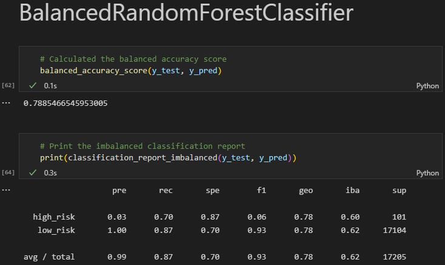

# Challenge 17, Deliverable 4
## Overview of the analysis
The purpose of this analysis is to measure the success of each model (which is measured by a number of metrics like accuracy, precision, recall, and ordering the importance of the features measured) against loan data. From the given data, we want our models to be able to predict if someone applying for a loan will be a high or low risk loan recipient. We compare the different models' success rates against each other to determine which is the best for this use case.

## Results

Naive Random Oversampling 
- accuracy: 0.6645971634511387
- precision: 0.65
- recall (sensitivity): 0.71
- f1: 0.68

SMOTE Oversampling
- accuracy: 0.6867426353229782
- precision: 0.66
- recall (sensitivity): 0.76
- f1: 0.68

ClusterCentroid Undersampling
- accuracy: 0.6804582210242587
- precision: 0.65
- recall (sensitivity): 0.60
- f1: 0.63

SMOTEENN Combination
- accuracy: 0.6594806463685973
- precision: 0.66
- recall (sensitivity): 0.60
- f1: 0.70

Balanced Random Forest Classifier Emsemble
- accuracy: 0.7885466545953005
- precision: 0.03
- recall (sensitivity): 0.70
- f1: 0.06

Easy Ensemble AdaBoost Classifer
- accuracy: 0.9316600714093861
- precision: 0.09
- recall (sensitivity): 0.92
- f1: 0.16

## Summary
To summarize the results, each machine learning model has pros and cons to being used against this set of data. Because the data is unbalanced by nature (lenders are more likely on average to give out low risk loans as opposed to high risk loans), certain techniques are more favorable than others. To preface this section, let's go back over a few key terms:

- Accuracy
    - in this context, it is evaluated as `(True Positive (TP) + True Negative (TN))/(Total Sample Size)`. For these tests, having a high accuracy is favorable because it measures how often on average a model's prediction is correct when compared to actual data.
- Precision
    -  it is evaluated as `TP/(TP + (F)alse (P)ositives)`. For these tests, having a high precision is favorable as we want high result reproducibility and consistent predictions based on the features of the dataset.
-  Recall (Sensitivity)
    -  it is evaluated as `TP/(TP + (F)alse (N)egatives)`. For these test, having a higher recall is favorable as lenders would rather reject a projected high risk loan which is actually a low risk loan, than accept a projected low risk loan that is actually high risk. 

NaiveRandomOversampling had a low/moderate accuracy, low/moderate precision, and moderate recall. SMOTE Oversampling had a moderate accuracy, moderate precision, and moderate/high recall. ClusterCentroid had a moderate accuracy, moderate precision, and low/moderate recall. SMOTEEN Combination Oversampling & Undersampling had a low/moderate accuracy, low/moderate precision, and low recall. Balanced Random Forest Classifier Ensemble had a moderate/high accuracy, almost _nonexistent_ precision, and an extremely high recall. Easy Ensemble AdaBoost Classifer had a moderate/high accuracy, almost _nonexistent_ precision, and an extremely high recall.

Based off of these results, if I had to choose one of the models from the list, I would recommend using the SMOTE Oversampling in a real world situation. This model gives a moderate accuracy, meaning that when a person is going to be a high risk loan, the model will tell you they are a high risk loan 68.6% of the time. This model's precision is also moderate, meaning that answers given will likely be given  probably saying that _everyone is a high risk loan_. But, because most business do not rely solely on robots and automation to make importance decisions, there will be others to verify this model's predictions, do more background checks on who is receiving the loan, and make a more well-informed decision. 

If I did not have to choose, I would not recommend using any of the models as I do not believe that their performances were adequate for real world usage without further support, making it basically useless.
